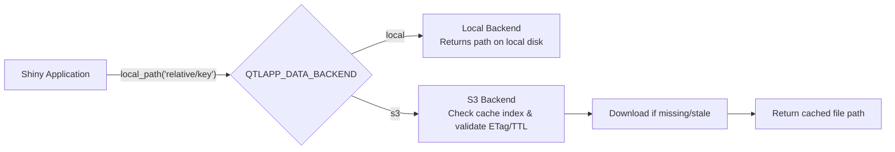

# Developer Guide for AttieLab QTL Viewer

This document provides technical instructions, architecture guidelines, and developer reference material for building, extending, and maintaining **AttieLab QTL Viewer** (`qtlApp`).

---

## 1. Architecture & Repository Layout

`qtlApp` is a modular R/Shiny web application designed for interactive exploration of Quantitative Trait Loci (QTL) in Diversity Outbred (DO) mouse datasets.

### Key Files and Directories

| Path | Description |
| :--- | :--- |
| [`app.R`](app.R) | Application entry point: initializes parallel workers, sources [`R/`](R/) modules, builds main UI/Server. |
| [`R/`](R/) | Application source files, Shiny modules, data abstraction layer, and plotting utilities. |
| [`DESCRIPTION`](DESCRIPTION) | Package metadata, versioning, and dependency declarations (`qtlApp` v0.2.0). |
| [`install_packages.R`](install_packages.R) | Dependency installer script for CRAN and Bioconductor packages. |
| [`manifest.json`](manifest.json) | Posit Connect deployment manifest file. |
| [`.lintr`](.lintr) | `lintr` configuration for static code analysis. |
| [`.github/workflows/R-CMD-check.yaml`](.github/workflows/R-CMD-check.yaml) | Continuous integration workflow executing package verification. |
| [`README.md`](README.md) | Project introduction, live application URL, and Zenodo citation details. |
| [`CONTRIBUTING.md`](CONTRIBUTING.md) | Guidelines for reporting bugs, submitting pull requests, and coding standards. |

### Modular Shiny Design

The codebase follows a modular design pattern. Functional areas (such as scan plots, correlation, mediation, SNP association) are implemented as Shiny module pairs in [`R/`](R/):

- **Scan & LOD Plots:** [`R/scanPlotModule.R`](R/scanPlotModule.R), [`R/ggplot_qtl_scan.R`](R/ggplot_qtl_scan.R), [`R/ggplotly_qtl_scan.R`](R/ggplotly_qtl_scan.R)
- **Manhattan & Cis/Trans Plots:** [`R/manhattanPlotApp.R`](R/manhattanPlotApp.R), [`R/cisTransPlotApp.R`](R/cisTransPlotApp.R)
- **Correlation & Profile Plots:** [`R/correlationApp.R`](R/correlationApp.R), [`R/profilePlotApp.R`](R/profilePlotApp.R), [`R/isoform_correlation_functions.R`](R/isoform_correlation_functions.R)
- **Mediation & SNP Association:** [`R/mediationTab.R`](R/mediationTab.R), [`R/snpAssociationTab.R`](R/snpAssociationTab.R)
- **Peaks Table & Info:** [`R/peaksTableModule.R`](R/peaksTableModule.R), [`R/peak_info.R`](R/peak_info.R), [`R/peak_finder.R`](R/peak_finder.R)

---

## 2. Data & Storage Abstraction Layer

All data access in `qtlApp` is decoupled from direct file paths or S3 API calls. Downstream modules call `local_path("relative/key")` from [`R/data_source.R`](R/data_source.R).




### Storage Backends

1. **Local Backend (`QTLAPP_DATA_BACKEND=local`)**:
   - Resolves data paths relative to `QTLAPP_DATA_ROOT`.
   - Used for local development and self-contained server deployments.
2. **S3 Backend (`QTLAPP_DATA_BACKEND=s3`)**:
   - Retrieves data objects from an AWS S3 or MinIO/Ceph bucket (`paws.storage`).
   - Caches files in `QTLAPP_CACHE_DIR` with size enforcement (`QTLAPP_CACHE_MAX_GB`).
   - Uses cross-process locking via `filelock` ([`R/s3_cache.R`](R/s3_cache.R) and [`R/s3_io.R`](R/s3_io.R)) to ensure safety across concurrent worker processes.

### High-Performance Data Access (`.fst`)

Genomic expression and QTL scan data are stored in `.fst` format. Fast row and column subsetting is handled via functions in [`R/fst_rows.R`](R/fst_rows.R) to minimize memory consumption and maximize query speed.

---

## 3. Environment Configuration (`QTLAPP_*` Variables)

Configuration is parsed at startup by [`R/config.R`](R/config.R) and cached in an internal environment.

| Environment Variable | Default | Description |
| :--- | :--- | :--- |
| `QTLAPP_DATA_BACKEND` | `local` | Data backend: `local` or `s3`. |
| `QTLAPP_DATA_ROOT` | `/data/dev/miniViewer_3.0` | Base directory path for local data backend. |
| `QTLAPP_S3_BUCKET` | `""` | Name of S3 bucket (required when backend is `s3`). |
| `QTLAPP_S3_PREFIX` | `""` | Optional key prefix inside the S3 bucket. |
| `QTLAPP_S3_REGION` | `us-east-1` | S3 region (uses `AWS_DEFAULT_REGION` if set). |
| `QTLAPP_S3_ENDPOINT` | `""` | Custom S3 endpoint URL for MinIO, Ceph, or on-prem S3. |
| `QTLAPP_S3_FORCE_PATH_STYLE` | `true` | Set `true` for path-style S3 URLs (required for MinIO/Ceph). |
| `QTLAPP_CACHE_DIR` | `tempdir()/qtlapp_cache` | Local directory for cached S3 data objects. |
| `QTLAPP_CACHE_MAX_GB` | `15` | Maximum local S3 disk cache size in gigabytes. |
| `QTLAPP_ETAG_CHECK_MODE` | `on_stale` | S3 cache validation mode: `never`, `on_stale`, or `always`. |
| `QTLAPP_ETAG_CHECK_TTL_SECONDS` | `600` | ETag cache time-to-live before re-checking S3 (seconds). |
| `QTLAPP_PREWARM` | `true` | Enable background pre-warming of frequently accessed data. |
| `QTLAPP_FUTURE_WORKERS` | `8` | Number of background worker processes (`future::multisession`). |
| `QTLAPP_WARN` | `false` | Set `true` to surface cosmetic runtime warnings in server logs. |

---

## 4. Local Development Workflow

### Prerequisites & Setup

1. **Clone the repository:**
   ```bash
   git clone https://github.com/AttieLab-Systems-Genetics/AttieLab-QTL-Viewer.git
   cd AttieLab-QTL-Viewer
   ```

2. **Install R dependencies:**
   Execute [`install_packages.R`](install_packages.R) to install required CRAN and Bioconductor packages:
   ```bash
   Rscript install_packages.R
   ```

3. **Configure environment variables:**
   For local development against a local data root:
   ```bash
   export QTLAPP_DATA_BACKEND=local
   export QTLAPP_DATA_ROOT=/path/to/your/local/data
   ```

   For testing against an S3 bucket:
   ```bash
   export QTLAPP_DATA_BACKEND=s3
   export QTLAPP_S3_BUCKET=your-qtl-bucket
   export AWS_ACCESS_KEY_ID=your-key
   export AWS_SECRET_ACCESS_KEY=your-secret
   ```

4. **Launch the application:**
   ```bash
   R -e 'shiny::runApp("app.R", port = 3838)'
   ```

---

## 5. Asynchronous Processing & Performance

To prevent UI blocking during compute-intensive calculations (such as LOD scan rendering and correlation matrix calculation), `qtlApp` leverages `future` and `promises`:

- **Worker Pool Initialization:** [`app.R`](app.R) configures background workers using:
  ```r
  future::plan(future::multisession, workers = .qtl_workers)
  ```
- **Async Promises:** Heavy calculation routines wrap work in `future::future({...}) %...>%` blocks to yield control back to the Shiny event loop.
- **Cache Pre-warming:** On startup, [`R/prewarm.R`](R/prewarm.R) asynchronously loads core annotations and high-frequency data files into memory/cache if `QTLAPP_PREWARM=true`.

---

## 6. Coding Conventions & Best Practices

When contributing code to `qtlApp`, adhere to the following standards:

1. **Indentation & Formatting:**
   - Follow the 1-space indentation style maintained across existing files in [`R/`](R/).
   - Use `<-` for object assignment (avoid `=` for assignment).
2. **Package Namespacing:**
   - Use explicit package prefixes (`pkg::func()`) in exported functions and Shiny modules to avoid namespace collisions.
3. **Vector Subsetting Safety in R:**
   - When filtering character vectors or lines, ALWAYS use `grepl(...)` with `!grepl(...)` or `grep(..., invert = TRUE)`.
   - **NEVER** use `!grep(...)` (in R, `!2` evaluates to `FALSE`, which wipes the vector to `character(0)`).
4. **Data Access Hygiene:**
   - Never hardcode absolute file paths or direct S3 client invocations inside Shiny UI/Server modules.
   - Always route data requests through `local_path("relative/key")` from [`R/data_source.R`](R/data_source.R).
5. **Shiny Module Signature:**
   - Structure new components as paired `<name>UI(id)` and `<name>Server(id, ...)` functions.
   - Maintain strict encapsulation with no global state mutation.

---

## 7. Testing, Linting & CI/CD

### Static Analysis with `lintr`

Run `lintr` to inspect code quality against project guidelines defined in [`.lintr`](.lintr):

```r
lintr::lint_dir("R")
```

### Package Verification

Run local package checks using `rcmdcheck`:

```r
rcmdcheck::rcmdcheck(args = c("--no-manual", "--no-tests"))
```

> **Note:** Because `qtlApp` is deployed as an interactive Shiny application rather than a CRAN R package, `--as-cran` checks are omitted in CI ([`.github/workflows/R-CMD-check.yaml`](.github/workflows/R-CMD-check.yaml)) to prevent non-applicable warnings from blocking builds.

---

## 8. Deployment Options

### Posit Connect Deployment

`qtlApp` is optimized for deployment on Posit Connect. Connect reads configuration from the **Vars** environment tab.

1. Ensure [`manifest.json`](manifest.json) is updated if package dependencies change:
   ```r
   rsconnect::writeManifest()
   ```
2. Deploy via `rsconnect::deployApp()` or Posit Connect Git integration.

### Docker Host Deployment

The application runs inside standard R/Shiny Docker containers (e.g., `rocker/shiny-verse`). Configure environment variables via container flags:

```bash
docker run -d \
  -p 3838:3838 \
  -e QTLAPP_DATA_BACKEND=s3 \
  -e QTLAPP_S3_BUCKET=qtl-data-bucket \
  -e QTLAPP_FUTURE_WORKERS=8 \
  qtlapp:latest
```
